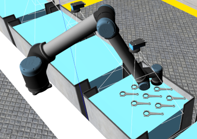
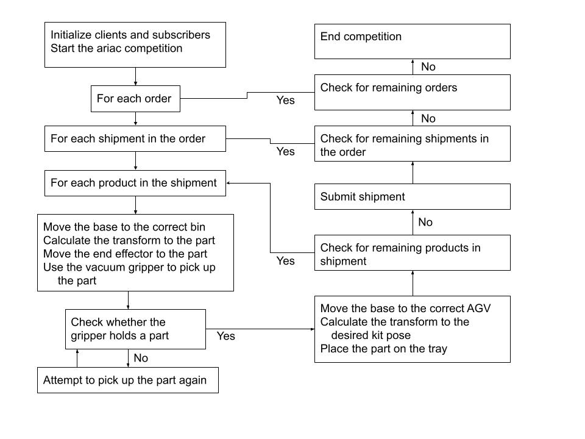
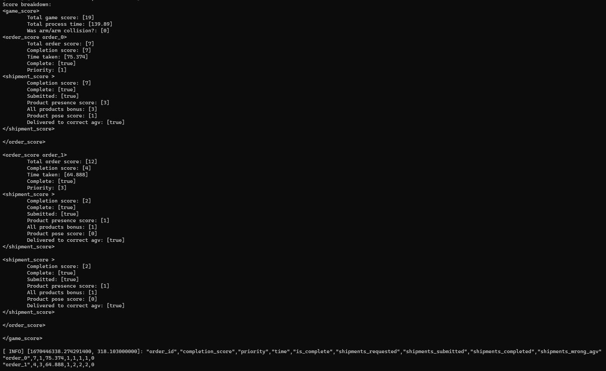

# Final Project
Team 6  
Seongmin Jung, Noah Mollerstuen, Rafay Chaudhry  
Professor Lee  
ECSE 373  
Last modified: 16 November 2022  

---

## Ariac Environemnt Setup
This lab uses the 2019 ARIAC simulation environemnt developed by the Open Source Robotics Foundation. To find out more about the ARIAC environement, read the documentation [here](https://bitbucket.org/osrf/ariac/wiki/2019/Home).

### Run the simulation

To run the simulation, you will need this course's ARIAC package which can be found [here](https://github.com/cwru-eecs-373/ecse_373_ariac). However, there is a bug at the empy module for Python3. The first solution is runing

    roslaunch ecse_373_ariac ecse_373_ariac.launch python:=false &

to launch the simulation. The second solution is fixing the issue in the Python module directly.

    # Path the em.py file of the Python3 empy module.
    sudo patch /usr/lib/python3/dist-packages/em.py < `rospack find ecse_373_ariac`/patches/empy.patch

and then run the `roslaunch` command without python argument.  
If you still have an error, try the command below:

    sudo apt install update-alternatives
    update-alternatives --install /usr/bin/python python /usr/bin/python2.7 1
    update-alternatives --install /usr/bin/python python /usr/bin/python3 2

The `cwru_ecse_373_submission` package is designed to interface with the ARIAC environment to control the simulation and locate parts which have been ordered. After installing and building the package, run `rosrun cwru_ecse_373_submission ariac_interface` to start the node. You may need to unpause the Gazebo simulation. The arm will respond to orders by loading the AGVs with the desired products. Note: this package has a launch file, but due to a known issue with the araic launch script, starting the simulation using the launch file in this package will prevent the arm from functioning.    

### Inverse Kinematics Implementation
This package uses an inverse kinematics library to control a robotics arm. Becuase the arm has 6 degrees of freedom. there are often multiple solutions that all reach the desired position and orientation of the end effector. To resolve this, the shoulder lift angle is constrained to a 90 degree arc between directly forward and directly up, and the wrist 1 joint is constrained to a 180 degree arc. These constraints ensure there is only one solution for each target pose.

## Tags
### `labratory_5`
Subscribe to orders on the `/ariac/orders` topic and calculate the transform from the arm frame to the part frame.
### `labratory_6`
Use the calculated transform to move the end effector to each part of the correct type according to the order.
### `phase_1`
Use the vacuum gripper service to pickup each of the parts of the correct type. Subscribe to the gripper feedback topic and retry the grab if it fails.
### `phase_4`
Loop over each shipment in each order and deliver each part in the shipment to the correct AGV. Use the submit shipment topic to complete shipments and score points in the ariac competition.

## Theory of Operations

## Score Breakdown
